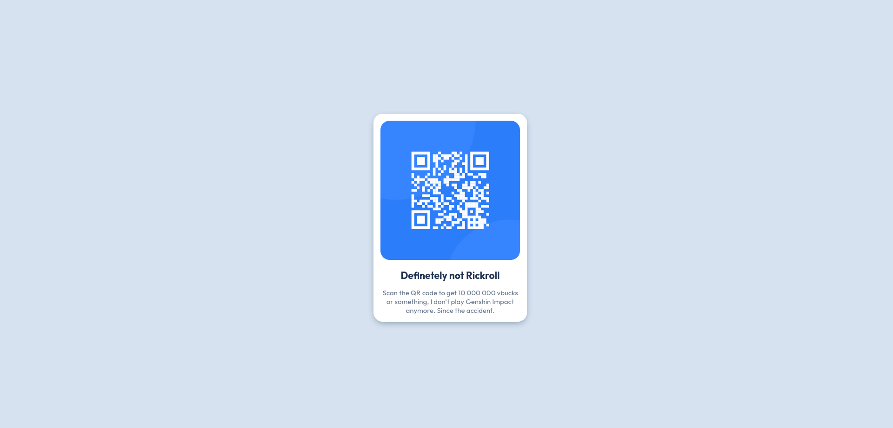

# Frontend Mentor - QR code component solution

This is a solution to the [QR code component challenge on Frontend Mentor](https://www.frontendmentor.io/challenges/qr-code-component-iux_sIO_H). Frontend Mentor challenges help you improve your coding skills by building realistic projects.

## Overview



Built with:

- Semantic HTML5 markup
- CSS custom properties
- Viewport centering
- [Box-shadow generator](https://active-vision.ru/icon/box-shadow/)

## What I learned

After almost 2 years of giving up on becoming a web developer, I returned with almost no memory of tools and workflow. So, this challenge was a good experience for me, because I remembered a lot of stuff from college. 

But, as always, centering a div is a problem. My first idea was using Flexbox, but then I was stuck with responsitivity issues. So, I found [this solution](https://www.w3.org/Style/Examples/007/center.en.html#viewport3):

```css
.please_for_gods_sake_just_center_already {
  position: absolute;
  top: 50%;
  left: 50%;
  margin-right: -50%;
  transform: translate(-50%, -50%);
}
```

### Continued development

There were problems with the QR code image. Still learning how to deal with \ scaling. Right now I did it like this:

```css
img {
  width: auto;
  height: auto;
  max-width: 300px;
  max-height: 300px;
}
```

## Author

- Frontend Mentor - [@egorpya](https://www.frontendmentor.io/profile/egorpya)
- Mastodon - [@egorp](https://social.vivaldi.net/@egorp) (inactive for some time already)

